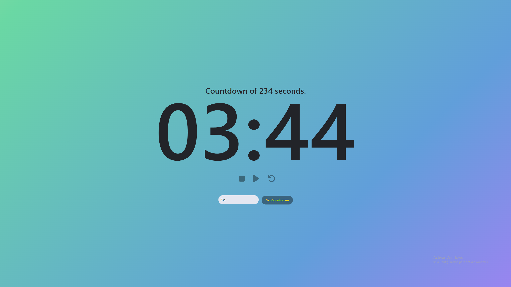

<h1>React Counter App</h1>
<h2>Overview</h2>
This project is a simple counter application built using React. It tracks the time elapsed since page load and allows users to set countdowns. It was developed as part of the 4Geeks Academy España curriculum, serving as a practical exercise to reinforce learning about React components, state management, and JSX syntax.

<h2>Features</h2>
<ul>
  <li>Dynamic counter that updates in real-time.</li>
  <li>Tracks time elapsed since page load.</li>
  <li>Allows users to set countdowns and customize the duration.</li>
</ul>
<h2>Technologies Used</h2>
<p align="center">
  <a href="https://skillicons.dev">
    
  </a>
</p>
<h2>Getting Started</h2>

1. Clone the repository:

```bash
git clone https://github.com/BlondyMartinez/SimpleCounter.git
```
2. Install dependencies:

```bash
cd SimpleCounter
npm install
```
3. Start the development server:
```bash
npm run start
```

<h2>Preview</h2>
<div style="display: flex; justify-content: center;">
  
</div>
